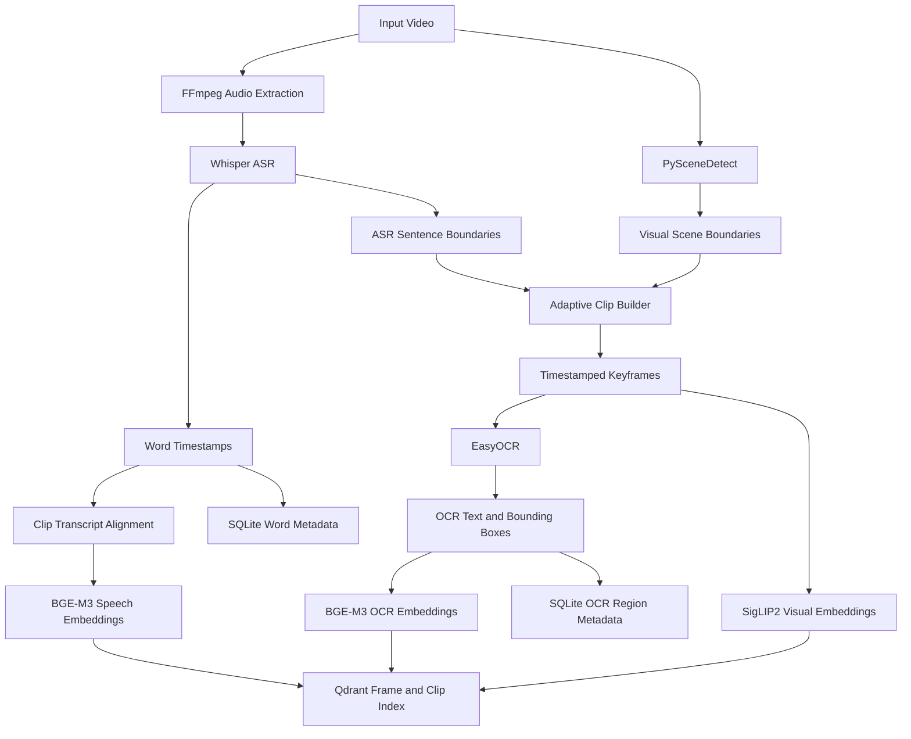
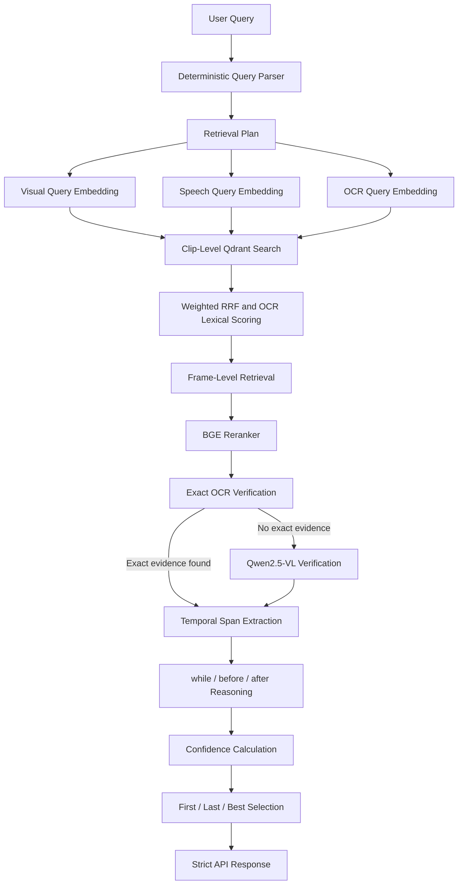

<div align="center">

# 🎬 Spatio-Temporal Multimodal Video RAG

### 🔎 Precise Video Moment Retrieval Across Vision, Speech, OCR, Space, and Time

</div>


<p align="center">
  
</p>

<p align="center">
  <strong>Whisper · EasyOCR · BGE-M3 · SigLIP2 · Qwen2.5-VL · Qdrant · FastAPI</strong>
</p>

An end-to-end multimodal video retrieval system that locates precise moments in a video by combining:

- visual content,
- spoken language,
- on-screen text,
- spatial grounding,
- and temporal relationships.


### 🧠 What the System Understands

| Modality | What It Detects | Main Component |
|---|---|---|
| 🎙️ Speech | What the speaker says and when | Whisper |
| 📝 OCR | Text displayed on the screen | EasyOCR |
| 👁️ Vision | Visual scenes, interfaces, and objects | SigLIP2 |
| 📍 Space | Where evidence appears in a frame | OCR boxes / Qwen-VL |
| ⏱️ Time | First, last, while, before, and after | Temporal Reasoner |

The system supports queries such as:

```text
Where does "EXPOSE 8080" first appear in the Dockerfile?
```

```text
Show the screen text "PORT FORWARDING" while the speaker says "port forwarding".
```

Instead of returning only a relevant video or a broad clip, the system returns a precise temporal interval:

```json
{
  "start_timestamp": "00:00:28.590",
  "end_timestamp": "00:00:30.040",
  "confidence_score": 0.7382
}
```

---

## 📚 Table of Contents

- [Overview](#overview)
- [Key Features](#key-features)
- [System Architecture](#system-architecture)
- [How the Pipeline Works](#how-the-pipeline-works)
- [Models Used](#models-used)
- [Clip-Level and Frame-Level Retrieval](#clip-level-and-frame-level-retrieval)
- [Storage Architecture](#storage-architecture)
- [Project Structure](#project-structure)
- [Installation](#installation)
- [Configuration](#configuration)
- [Quick Start](#quick-start)
- [API Reference](#api-reference)
- [Example Queries](#example-queries)
- [Experimental Results](#experimental-results)
- [Memory Management](#memory-management)
- [Design Decisions](#design-decisions)
- [Limitations](#limitations)
- [Future Work](#future-work)
- [Contributing](#contributing)
- [License](#license)

---

## 🧭 Overview

Traditional video retrieval systems often search only one modality:

- speech transcripts,
- visual embeddings,
- or OCR text.

This project combines all three and adds explicit spatial and temporal reasoning.

The system answers not only:

> Which clip is relevant?

It also answers:

> Which frame contains the evidence?

> Where is the requested text or object located?

> Did two events happen at the same time?

> Which valid occurrence was first or last?

The system contains two main pipelines:

1. **Ingestion pipeline**  
   Processes and indexes a video once.

2. **Search pipeline**  
   Executes a new multimodal query against the indexed video.

---

## ✨ Key Features

- Content-aware scene detection using PySceneDetect.
- Speech-aware clip segmentation using ASR sentence boundaries.
- Word-level timestamps from Whisper.
- Spatial OCR with text confidence and bounding boxes.
- Text embeddings for speech and OCR.
- Visual embeddings for frames and visual queries.
- Persistent Qdrant vector indexing.
- Coarse clip-level retrieval.
- Fine frame-level retrieval.
- Weighted Reciprocal Rank Fusion.
- OCR lexical matching for exact commands and numbers.
- Cross-encoder reranking.
- Exact OCR-region verification.
- Vision-language fallback verification.
- Temporal relations:
  - `while`
  - `before`
  - `after`
- Temporal selectors:
  - `first`
  - `last`
  - `any`
- Strict FastAPI response contract.
- Explicit GPU model lifecycle management.
- CPU and local-vector fallback paths.
- Performance and memory measurement.
- Manual-ground-truth support for Temporal IoU evaluation.

---

## 🏗️ System Architecture



### Search architecture



---

## 🔄 How the Pipeline Works

# 1. 📥 Ingestion Pipeline

## 1.1 Video validation and metadata extraction

OpenCV opens the video and extracts:

- frames per second,
- total frame count,
- width,
- height,
- duration.

Example metadata:

```json
{
  "fps": 30.0,
  "frames": 19840,
  "width": 1280,
  "height": 720,
  "duration": 661.327
}
```

## 1.2 Audio extraction

FFmpeg converts the video audio into a Whisper-compatible WAV file:

```text
PCM signed 16-bit
16,000 Hz
mono
```

Output example:

```text
storage/processed/<video_id>/audio.wav
```

## 1.3 Speech transcription

`faster-whisper` transcribes the spoken audio and returns word-level timestamps:

```json
[
  {
    "word": "port",
    "start": 30.90,
    "end": 31.10
  },
  {
    "word": "forwarding",
    "start": 31.10,
    "end": 31.68
  }
]
```

These timestamps are used for:

- clip transcript alignment,
- speech search,
- sentence-boundary detection,
- temporal relation evaluation.

## 1.4 Scene detection

PySceneDetect uses `ContentDetector` with a threshold of `27.0`.

It detects visually significant transitions between consecutive frames.

```python
ContentDetector(threshold=27.0)
```

If content-aware detection fails, the system falls back to fixed windows of approximately six seconds.

## 1.5 Adaptive clip construction

Final clip boundaries combine:

- start and end of the video,
- scene boundaries,
- ASR sentence boundaries.

The clip builder then:

- removes boundaries closer than `1.25` seconds,
- prevents clips shorter than `1.5` seconds,
- splits clips longer than `10` seconds.

Default settings:

```python
min_clip = 1.5
max_clip = 10.0
dedup_gap = 1.25
```

## 1.6 Keyframe extraction

The system samples approximately one frame per second:

```python
frame_sample_fps = 1.0
```

It also includes representative positions near:

- the beginning,
- the middle,
- and the end of the clip.

A maximum of eight keyframes is retained per clip.

## 1.7 Spatial OCR

EasyOCR processes selected keyframes and returns:

- detected text,
- confidence,
- pixel bounding box,
- normalized bounding box,
- frame timestamp.

Example:

```json
{
  "text": "EXPOSE 8080",
  "confidence": 0.6703,
  "bbox": [343, 205, 437, 225],
  "bbox_norm": [536, 569, 683, 625]
}
```

Repeated OCR observations are merged into temporal OCR intervals.

## 1.8 Multimodal embeddings

The project creates:

- clip-level visual embeddings,
- clip-level speech embeddings,
- clip-level OCR embeddings,
- frame-level visual embeddings,
- frame-level OCR embeddings.

The vectors are L2-normalized before indexing.

## 1.9 Persistent indexing

The embeddings and metadata are stored in:

- Qdrant for vector retrieval,
- SQLite for precise word and OCR-region metadata,
- JSON files as a local vector-search fallback,
- the local filesystem for audio and keyframes.

---

# 2. 🔍 Search Pipeline

## 2.1 Query understanding

The default query parser is deterministic.

It identifies:

- active modalities,
- temporal selector,
- temporal relation,
- modality-specific clauses,
- spatial-grounding requirements.

Example:

```text
Show the screen text "PORT FORWARDING"
while the speaker says "port forwarding"
```

Parsed intent:

```json
{
  "temporal_selector": "any",
  "temporal_relation": "while",
  "needs_visual": true,
  "needs_speech": true,
  "needs_ocr": true,
  "ocr_query": "Show the screen text \"PORT FORWARDING\"",
  "speech_query": "the speaker says \"port forwarding\""
}
```

## 2.2 Query embeddings

Query embeddings are generated only at search time.

They are not stored permanently.

- visual query: SigLIP2, 768 dimensions,
- speech query: BGE-M3, 1024 dimensions,
- OCR query: BGE-M3, 1024 dimensions.

The vectors remain temporarily in memory and are passed directly to Qdrant.

## 2.3 Clip-level retrieval

The system searches the clip collection independently for each active modality.

Examples:

- visual query against visual vectors,
- speech query against speech vectors,
- OCR query against OCR vectors.

## 2.4 Weighted Reciprocal Rank Fusion

The independent result lists are combined using Weighted RRF:

```text
RRF(candidate) =
sum over modalities:
weight(modality) / (60 + rank + 1)
```

Default weighting examples:

```text
Visual + OCR:
visual = 0.35
ocr    = 0.65
```

```text
Visual + Speech + OCR:
visual = 0.30
speech = 0.30
ocr    = 0.40
```

## 2.5 OCR lexical enhancement

Semantic embeddings can confuse similar commands or numbers.

For example:

```text
EXPOSE 8080
EXPOSE 8880
ENV PORT-8080
```

The system therefore combines vector similarity with direct OCR lexical matching:

```text
enhanced retrieval =
0.75 × vector retrieval
+
0.25 × OCR lexical score
```

## 2.6 Frame-level retrieval

After selecting the strongest clips, the system searches only their associated frames.

This produces more precise evidence:

```json
{
  "frame_id": "clip_6_frame_1",
  "timestamp": 28.94,
  "modality": "ocr",
  "score": 0.91
}
```

## 2.7 Cross-encoder reranking

The BGE reranker evaluates each query-candidate pair jointly.

Candidate content contains:

- clip transcript,
- clip OCR text.

The final reranking signal combines:

```text
0.80 × model reranker score
+
0.20 × OCR lexical score
```

## 2.8 Spatial verification

The system first attempts exact OCR-region verification.

If an exact OCR target is found, it returns:

- matched text,
- matched target,
- timestamp,
- bounding box,
- spatial confidence.

If exact OCR evidence is unavailable, Qwen2.5-VL can inspect the strongest frames.

## 2.9 Temporal reasoning

The system extracts modality-specific spans.

Example:

```text
Speech span: [30.90, 31.68]
OCR span:    [30.94, 31.69]
```

For a `while` query, it calculates the intersection:

```text
Result: [30.94, 31.68]
```

A candidate is rejected if a required temporal relation is not satisfied.

Supported rules:

```text
while:
intersection(left_span, right_span) must be non-empty

before:
left.end <= right.start + 0.25

after:
left.start >= right.end - 0.25
```

## 2.10 Confidence scoring

The final confidence score is a weighted heuristic:

```text
C =
0.25 × retrieval
+
0.25 × cross-encoder
+
0.20 × verification
+
0.20 × temporal
+
0.10 × spatial
```

This value is a composite ranking score, not a calibrated probability.

## 2.11 Result selection

- `first`: earliest valid candidate,
- `last`: latest valid candidate,
- `any`: highest-confidence valid candidate.

The strict endpoint returns only:

```json
{
  "start_timestamp": "HH:MM:SS.mmm",
  "end_timestamp": "HH:MM:SS.mmm",
  "confidence_score": 0.0
}
```

---

## 🧠 Models Used

| Component | Model or Engine | Purpose | Input | Output |
|---|---|---|---|---|
| Speech recognition | `faster-whisper` `large-v3-turbo` | Converts spoken audio into words with timestamps | WAV audio | Word-level transcript |
| OCR | EasyOCR | Reads on-screen text and locates it spatially | Keyframe image | Text, confidence, bounding box |
| Text embeddings | `BAAI/bge-m3` | Encodes speech, OCR, and text queries | Text | 1024-dimensional vector |
| Visual embeddings | `google/siglip2-base-patch16-224` | Encodes frames and visual text queries | Image or visual query | 768-dimensional vector |
| Reranking | `BAAI/bge-reranker-v2-m3` | Reorders retrieved candidates | Query-candidate pair | Relevance score |
| Visual verification | `Qwen/Qwen2.5-VL-3B-Instruct` | Verifies visual evidence when OCR is insufficient | Query and selected frames | Match, frame range, box, confidence |
| Optional query planner | `Qwen/Qwen2.5-3B-Instruct` | Produces a structured retrieval plan | User query | Structured JSON intent |

### Optional and fallback behavior

- The Qwen text query planner is disabled by default.
- The deterministic parser is the default because it is faster and reproducible.
- If `large-v3-turbo` cannot load, the system attempts Whisper `base` on CPU.
- A SpeechRecognition path is available as a final ASR fallback.
- Qwen-VL is loaded only when exact OCR verification is insufficient.

---

## 🎞️ Clip-Level and Frame-Level Retrieval

The system uses two retrieval resolutions.

### Clip level

A clip is a short temporal segment containing:

- several keyframes,
- speech transcript,
- word timestamps,
- OCR observations,
- visual embedding,
- speech embedding,
- OCR embedding.

Clip-level retrieval answers:

> Which temporal segment is most likely to contain the requested event?

### Frame level

A frame is one image sampled from a clip.

It contains:

- one timestamp,
- one image path,
- visual embedding,
- OCR text,
- OCR regions.

Frame-level retrieval answers:

> Which exact image inside the selected clip contains the strongest evidence?

```text
Video
└── Clip
    ├── Frame
    ├── Frame
    └── Frame
```

The clip collection provides context.  
The frame collection provides precision.

---

## 🗄️ Storage Architecture

# 🧊 Qdrant Collections

## `spatio_temporal_clips`

Named vectors:

| Vector | Dimension | Source |
|---|---:|---|
| `visual` | 768 | SigLIP2 |
| `speech` | 1024 | BGE-M3 |
| `ocr` | 1024 | BGE-M3 |

Important payload fields:

```text
candidate_id
video_id
clip_id
start_ts
end_ts
duration
transcript
ocr_text
word_timestamps
ocr_observations
ocr_intervals
keyframes
```

Candidate identity:

```text
<video_id>:<clip_id>
```

## `spatio_temporal_frames`

Named vectors:

| Vector | Dimension | Source |
|---|---:|---|
| `visual` | 768 | SigLIP2 |
| `ocr` | 1024 | BGE-M3 |

Important payload fields:

```text
frame_candidate_id
candidate_id
video_id
clip_id
frame_id
timestamp
path
ocr_text
ocr_regions
width
height
```

Frame identity:

```text
<video_id>:<clip_id>:<frame_id>
```

# 🗃️ SQLite Tables

## `word_timestamps`

Stores precise word timing:

```text
video_id
clip_id
word
start_ts
end_ts
```

## `ocr_regions`

Stores precise spatial OCR evidence:

```text
video_id
clip_id
frame_id
timestamp
text
confidence
bbox_json
bbox_norm_json
frame_path
```

# 💾 Other Storage

```text
storage/qdrant_db/
storage/processed/
storage/performance_metrics.json
storage/index_spatio_temporal_clips.json
storage/index_spatio_temporal_frames.json
```

---

## 📁 Project Structure

```text
.
├── api/
│   ├── __init__.py
│   ├── main.py
│   └── schemas.py
├── evaluation/
│   ├── __init__.py
│   └── metrics.py
├── ingestion/
│   ├── __init__.py
│   ├── embedder.py
│   ├── indexer.py
│   ├── ocr_extractor.py
│   ├── scene_detector.py
│   ├── transcriber.py
│   └── video_processor.py
├── monitoring/
│   ├── __init__.py
│   └── performance.py
├── runtime/
│   ├── __init__.py
│   └── model_manager.py
├── search/
│   ├── __init__.py
│   ├── confidence.py
│   ├── device_detector.py
│   ├── query_planner.py
│   ├── query_understanding.py
│   ├── refiner.py
│   ├── reranker.py
│   ├── retrieval_planner.py
│   ├── retriever.py
│   ├── temporal_reasoner.py
│   └── verification.py
├── storage/
│   ├── __init__.py
│   └── metadata_store.py
├── Spatio_Temporal_Video_RAG_Final_Clean.ipynb
└── README.md
```

---

## ⚙️ Installation

## Requirements

Recommended environment:

- Python 3.10 or newer,
- FFmpeg,
- CUDA-capable GPU for full model execution,
- approximately 16 GB GPU memory per T4-class device for comfortable staged execution,
- Linux, Kaggle, or Google Colab.

The project was tested using two NVIDIA Tesla T4 GPUs, but it can use one GPU through staged model loading.

## 1. Clone the repository

```bash
git clone https://github.com/YOUR_USERNAME/spatio-temporal-video-rag.git
cd spatio-temporal-video-rag
```

## 2. Install FFmpeg

Ubuntu or Debian:

```bash
sudo apt-get update
sudo apt-get install -y ffmpeg
```

## 3. Install Python dependencies

```bash
pip install \
  "transformers==4.57.6" \
  "sentence-transformers==5.6.0" \
  "qdrant-client==1.18.0" \
  "accelerate>=1.10,<2" \
  "bitsandbytes>=0.47,<0.50" \
  "faster-whisper>=1.1,<2" \
  "fastapi>=0.115,<0.130" \
  "uvicorn>=0.30,<1" \
  "scenedetect==0.7.1" \
  "easyocr>=1.7,<2" \
  "SpeechRecognition>=3.10,<4" \
  "psutil>=5.9,<8"
```

PyTorch must be installed using a build compatible with the local CUDA version.

## 4. Restart the notebook runtime

After changing PyTorch, Transformers, or CUDA-related package versions, restart the runtime before importing the project.

---

## 🛠️ Configuration

Default environment variables:

```bash
export PYTORCH_CUDA_ALLOC_CONF="expandable_segments:True,max_split_size_mb:128"
export TOKENIZERS_PARALLELISM="false"

export VIDEO_RAG_OCR_DEVICE="cuda:0"
export VIDEO_RAG_OCR_LANGS="en"
export VIDEO_RAG_OCR_FRAMES_PER_CLIP="6"
export VIDEO_RAG_OCR_CANVAS_SIZE="1280"

export VIDEO_RAG_QDRANT_PATH="storage/qdrant_db"
```

Optional GPU assignment:

```bash
export VIDEO_RAG_INGEST_GPU="0"
export VIDEO_RAG_SEARCH_GPU="1"
```

Enable the optional LLM query planner:

```bash
export VIDEO_RAG_USE_LLM_PLANNER="1"
```

The deterministic parser remains recommended for reproducible experiments.

---

## 🚀 Quick Start

# 📓 Notebook Workflow

1. Open:

```text
Spatio_Temporal_Video_RAG_Final_Clean.ipynb
```

2. Run the dependency and project-generation cells.

3. Set:

```python
VIDEO_ID = "my_video"
VIDEO_PATH = "/path/to/local/video.mp4"
```

4. Run the ingestion cell.

5. Run the search examples.

The notebook writes the Python modules into their respective package directories.

# 🌐 FastAPI Workflow

Start the server:

```bash
uvicorn api.main:app --host 0.0.0.0 --port 8000
```

Interactive documentation:

```text
http://127.0.0.1:8000/docs
```

---

## 🔌 API Reference

# 📥 `POST /ingest`

Indexes one local video.

Request:

```json
{
  "video_path": "/absolute/path/to/video.mp4",
  "video_id": "demo_video"
}
```

Current implementation requires a local file path. HTTP video URLs are rejected.

Response:

```json
{
  "status": "success",
  "video_id": "demo_video",
  "total_clips": 153,
  "total_frames": 992,
  "segmentation_method": "scene_plus_asr",
  "metrics": {}
}
```

Example:

```bash
curl -X POST "http://127.0.0.1:8000/ingest" \
  -H "Content-Type: application/json" \
  -d '{
    "video_path": "/absolute/path/to/video.mp4",
    "video_id": "demo_video"
  }'
```

# 🔍 `POST /search`

Returns the strict response contract.

Request:

```json
{
  "query": "Where does EXPOSE 8080 first appear in the Dockerfile?",
  "video_id": "demo_video"
}
```

Response:

```json
{
  "start_timestamp": "00:00:28.590",
  "end_timestamp": "00:00:30.040",
  "confidence_score": 0.7382
}
```

Example:

```bash
curl -X POST "http://127.0.0.1:8000/search" \
  -H "Content-Type: application/json" \
  -d '{
    "query": "Where does EXPOSE 8080 first appear in the Dockerfile?",
    "video_id": "demo_video"
  }'
```

# 🧾 `POST /search/detailed`

Returns debugging and evidence information in addition to the strict fields.

The detailed response can include:

```text
search_id
candidate_id
video_id
clip_id
speech_excerpt
ocr_text
retrieval_method
temporal_relation
relation_satisfied
modality_spans
spatial_evidence
scores
stage_latencies
```

# 🖥️ `GET /runtime`

Returns:

- loaded model status,
- GPU assignments,
- CUDA diagnostics.

# 🧹 `POST /runtime/release`

Explicitly releases all loaded models.

# 📈 `GET /metrics`

Returns aggregated performance metrics.

# 📋 `GET /metrics/report`

Returns a Markdown performance report.

---

## 🚨 Error Semantics

| HTTP Status | Meaning |
|---:|---|
| `400` | Invalid path, missing video input, or empty query |
| `404` | No candidate found or required temporal relation not satisfied |
| `409` | Vector index is not ready |

A temporal query does not silently return an unrelated best match.

For example, if no candidate satisfies `while`, the API returns `404`.

---

## 💬 Example Queries

### OCR-first query

```text
Where does EXPOSE 8080 first appear in the Dockerfile?
```

### Exact quoted text

```text
Where does "FROM node:12" first appear in the Dockerfile?
```

### OCR and speech synchronization

```text
Show the screen text "PORT FORWARDING"
while the speaker says "port forwarding".
```

### OCR command search

```text
Show the screen text "WORKDIR /app".
```

### Visual scene search

```text
Show the Dockerfile in the code editor.
```

### Negative temporal constraint

```text
Show the moment when "EXPOSE 8080" is displayed
while the speaker explains the exit function.
```

The last example should be rejected when no temporal overlap exists.

---

## 📊 Experimental Results

The following results were produced from one indexed test video.

They demonstrate system execution and architecture behavior.  
They are not a general retrieval-accuracy benchmark.

# 📥 Ingestion Snapshot

| Metric | Value |
|---|---:|
| Video duration | 661.327 seconds |
| Content-aware scenes | 30 |
| Final clips | 153 |
| Indexed frames | 992 |
| OCR-processed frames | 870 |
| OCR frames containing text | 831 |
| OCR regions | 12,565 |
| Ingestion time | 385.749 seconds |
| OCR backend | EasyOCR |

# 🔍 Search Examples

| Query | Predicted interval | Confidence |
|---|---|---:|
| `EXPOSE 8080` first appearance | `00:00:28.590–00:00:30.040` | 0.7382 |
| `FROM node:12` first appearance | `00:00:27.540–00:00:27.940` | 0.7953 |
| `PORT FORWARDING` while spoken | `00:00:30.590–00:00:31.732` | 0.6532 |
| `WORKDIR /app` | `00:04:42.480–00:04:43.580` | 0.6924 |
| Dockerfile in the editor | `00:03:59.260–00:04:00.360` | 0.6116 |

The first two OCR targets and the positive `while` relation were supported by runtime evidence.

The broader visual examples were returned successfully but were not independently manually annotated.

# ⏱️ Search Latency Snapshot

Five-query benchmark:

| Metric | Value |
|---|---:|
| Functional execution success | 5 / 5 |
| Mean wall latency | 23.4785 seconds |
| P50 wall latency | 23.1912 seconds |
| Reported notebook P95 | 24.9737 seconds |
| Maximum latency | 24.9737 seconds |

The benchmark includes cold or lazy model loading, explicit model release, garbage collection, and CUDA cleanup.

Five successful executions do not establish retrieval accuracy.

# 🧠 Memory Snapshot

| Device | Observed peak allocated VRAM |
|---|---:|
| GPU 0 | 2,900.93 MB |
| GPU 1 | 1,446.52 MB |

After model release, allocated memory returned to approximately 18.25 MB per GPU.

CUDA reserved memory may remain visible because of the PyTorch caching allocator.

---

## 🧹 Memory Management

The project avoids loading all neural models simultaneously.

### Ingestion lifecycle

```text
Whisper
→ release

EasyOCR
→ release

BGE-M3 and SigLIP2
→ release
```

### Search lifecycle

```text
Query parser
→ release

BGE-M3 and SigLIP2
→ release

BGE reranker
→ release

Qwen-VL when required
→ release
```

The `RuntimeModelManager` provides:

- lazy loading,
- explicit device assignment,
- deterministic model release,
- garbage collection,
- CUDA cache cleanup.

This staged design was introduced to prevent notebook kernel crashes and excessive VRAM usage.

---

## 🧩 Design Decisions

### Why combine scene and speech boundaries?

Scene detection preserves visual transitions.

ASR sentence boundaries preserve spoken semantic structure.

Combining both produces clips that are more meaningful than fixed windows alone.

### Why use separate clip and frame collections?

Clip-level indexing provides context.

Frame-level indexing provides temporal and spatial precision.

### Why use both vector and lexical OCR search?

Vector search handles semantic similarity.

Lexical scoring protects exact commands, filenames, numbers, and code tokens.

### Why use a deterministic query parser by default?

It is:

- faster,
- reproducible,
- easier to test,
- less memory-intensive,
- resistant to malformed JSON output.

### Why use Qwen-VL only as a fallback?

Exact OCR evidence is cheaper and usually more precise for on-screen text.

Qwen-VL is reserved for visual concepts that OCR cannot verify directly.

### Why use Qdrant and SQLite together?

Qdrant handles nearest-neighbor vector retrieval.

SQLite stores exact structured metadata such as:

- word start and end times,
- OCR region coordinates,
- frame paths,
- OCR confidence.

---

## 🧪 Evaluation

Temporal IoU is implemented as an evaluation utility, but it must be calculated only after independently annotating ground-truth intervals.

Example structure:

```python
manual_ground_truth = {
    "expose_8080": None,
    "from_node_12": None,
    "positive_while": None,
}
```

Do not reuse the system prediction as ground truth.

Until independent annotations are entered:

- do not report Temporal IoU,
- do not claim retrieval accuracy,
- treat the current results as functional validation.

---

## ⚠️ Limitations

- The current experiment uses one test video.
- Manual ground-truth intervals have not yet been entered.
- Temporal IoU is therefore not reported.
- The API currently accepts local video files only.
- OCR defaults to English.
- Sampling approximately one frame per second may miss extremely brief visual events.
- Search latency includes lazy model loading and cleanup.
- The confidence score is heuristic, not probabilistically calibrated.
- The visual fallback model increases latency when loaded.
- Query embeddings are generated again for each search and are not persistently cached.
- A broader multi-video and multilingual evaluation is still required.
- The `FROM node:12` result was clipped by a clip boundary even though OCR evidence extended beyond the returned end time.

---

## 🔭 Future Work

- Independent manual annotation and Temporal IoU reporting.
- Multi-video retrieval evaluation.
- Recall@K, MRR, and nDCG evaluation.
- Calibrated confidence estimation.
- Query-embedding caching.
- Batched visual and OCR processing.
- Faster warm-model serving mode.
- Remote video download support.
- Multilingual OCR configuration.
- Improved clip-boundary reconciliation.
- Object tracking across adjacent frames.
- Native video encoders for motion-sensitive queries.
- Docker deployment.
- Automated tests and continuous integration.
- Production authentication and rate limiting.

---

## 🤝 Contributing

Contributions are welcome.

Recommended workflow:

```bash
git checkout -b feature/your-feature
git commit -m "Add your feature"
git push origin feature/your-feature
```

Then open a pull request describing:

- the problem,
- the proposed change,
- tests performed,
- performance or memory impact.

Please avoid reporting accuracy improvements without independent ground truth.

---

## 📄 License

No license is included by default.

Before publishing the repository for public reuse, add an appropriate license such as:

- MIT,
- Apache-2.0,
- or another license compatible with the project dependencies and intended usage.

Model weights and external libraries remain subject to their respective licenses.

---

## 🙏 Acknowledgments

This project uses:

- PyTorch,
- Hugging Face Transformers,
- Sentence Transformers,
- faster-whisper,
- EasyOCR,
- PySceneDetect,
- OpenCV,
- Qdrant,
- FastAPI,
- FFmpeg.

---

## ✅ Responsible Reporting

The current repository demonstrates a research prototype.

The available runtime results support:

- successful ingestion,
- multimodal indexing,
- exact OCR grounding,
- positive and negative temporal relation handling,
- strict API output,
- staged GPU lifecycle management.

They do not yet support a general claim of retrieval accuracy because independent ground-truth annotations are still required.
