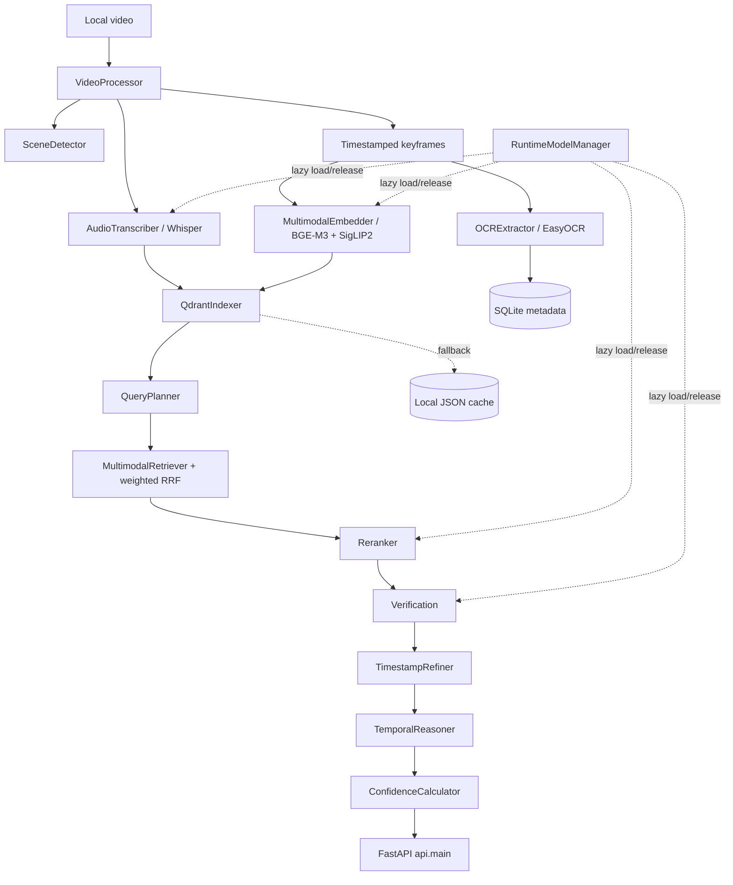

# Architecture

The committed Python tree is extracted from the notebook's `%%writefile` cells. The diagram below shows only components verified in that source.

## Runtime boundaries

- `ingestion/` prepares clips, ASR timestamps, OCR regions, embeddings, and indexes.
- `storage/` persists temporal and spatial metadata in SQLite; the indexer owns local Qdrant and JSON fallback behavior.
- `search/` parses queries, plans modalities, retrieves and reranks candidates, verifies evidence, reasons over temporal relations, and scores selections.
- `runtime/` keeps large model loading and release explicit.
- `api/` exposes ingestion, search, runtime, and performance endpoints.
- `evaluation/` contains deterministic interval metrics only; it does not contain an annotated benchmark.

The default local paths are relative to the repository root. GPU/model loading is lazy but full ingestion/search requires the documented heavy dependencies and a compatible runtime.
